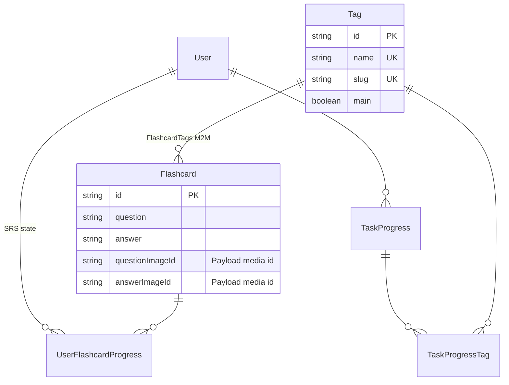
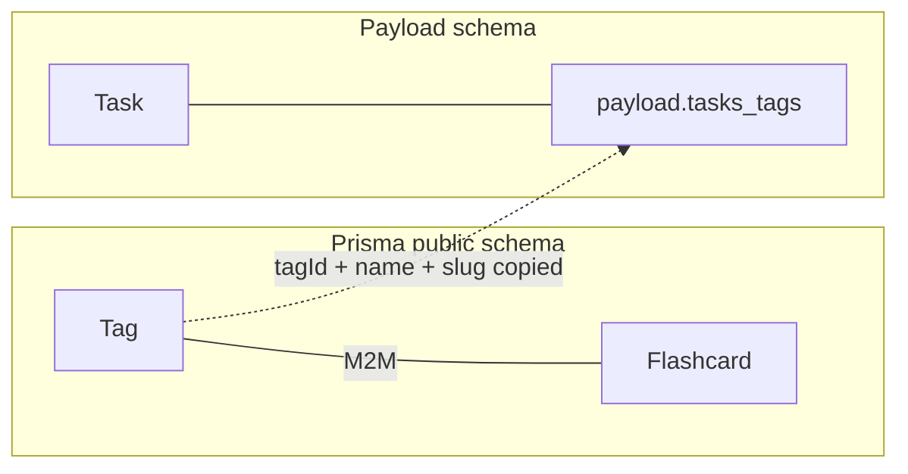

# Interview / learning content — data model & API reference

This document is generated from the **BrainStack** codebase (Next.js app + Payload CMS + Prisma). It answers how to model **courses**, **theory content**, **flashcards**, **tasks**, and **tags**, and how to create data in practice.

**Project layout note:** BrainStack currently lives under `LearningPlatform/LearningPlatform/` in this workspace (this file is there). Paths below are relative to that folder.

---

## Executive summary

| Concern | Where it lives |
|--------|----------------|
| **Course, Module, Lesson, Task, Media, Subject** | **Payload CMS** collections, tables under PostgreSQL schema `payload` |
| **Flashcard, Tag (canonical), user progress, SRS** | **Prisma** models, tables in `public` (e.g. `flashcards`, `tags`) |
| **Theory content** | **Not a separate table.** It is the `theoryBlocks` **blocks** field on the **Lesson** document (JSON array of typed blocks). |
| **Default Payload Admin UI** | **Disabled** (`admin.disable: true` in Payload config). You use the **custom `/admin` Next.js panel** and/or **programmatic** `payload.create` / Prisma. |

---

## 1. Schema analysis

### 1.1 Course (`courses` collection — Payload)

**Storage:** `payload.courses` (UUID string ids).

| Field | Payload type | Required | Notes |
|-------|--------------|----------|--------|
| `title` | text | **Yes** | |
| `slug` | text | **Yes** | Unique; validated: lowercase `a-z0-9` with hyphens; auto-derived from title in hooks if empty |
| `description` | richText (Lexical) | No | Optional marketing copy |
| `level` | select | **Yes** | `BEGINNER` \| `INTERMEDIATE` \| `ADVANCED` (default `BEGINNER`) |
| `subject` | relationship → `subjects` | **Yes** | Subject id (UUID string) |
| `coverImage` | upload → `media` | No | |
| `isPublished` | checkbox | No | Default `false`; students only see published courses |

**Relationships (conceptual):** A course has many **modules** (`modules.course`). Modules have many **lessons** (`lessons.module` + `lessons.course`). **Tasks** link to zero or more **lessons** (`tasks.lesson` hasMany).

---

### 1.2 TheoryBlock — lesson content blocks (`lessons.theoryBlocks`)

**There is no `TheoryBlock` database entity.** Theory is stored as an ordered array field **`theoryBlocks`** on each **Lesson**.

**Block types** (each array element has `blockType` matching the slug):

| `blockType` | Required subfields | Optional / defaults |
|-------------|-------------------|---------------------|
| `text` | `content` — **Lexical JSON** | — |
| `image` | `image` — **media id** (UUID string) | `caption`, `align` (`left`\|`center`\|`right`, default `center`), `width` (`sm`\|`md`\|`lg`\|`full`, default `md`) |
| `math` | `latex` — plain string | `displayMode` (bool, default `true`), `note` |
| `callout` | `variant` (`info`\|`warning`\|`tip`), `content` — Lexical JSON | `title` |
| `video` | `videoUrl` (YouTube URL), `aspectRatio` (`16:9`\|`4:3`, default `16:9`) | `title`, `caption` |
| `table` | — | `caption`, `hasHeaders` (default `true`), `headers` (JSON array of strings), `rows` (JSON array of string arrays) |

**Legacy field:** `lessons.content` — richText, **deprecated**; UI prefers `theoryBlocks` when present.

**Other lesson fields:**

| Field | Required | Notes |
|-------|----------|--------|
| `course` | **Yes** | Relationship to course |
| `module` | **Yes** | Relationship to module |
| `title` | **Yes** | |
| `order` | **Yes** | Positive integer; ordering within module |
| `theoryBlocks` | No | Primary content |
| `content` | No | Legacy richText |
| `attachments` | No | Array of `{ file (media, required), description }` |
| `lastUpdatedBy` | No | Set by server on update |
| `isPublished` | No | Default `false` |

---

### 1.3 Flashcard (`Flashcard` — Prisma / table `flashcards`)

| Column | Type | Required | Notes |
|--------|------|----------|--------|
| `id` | String (cuid) | Auto | Primary key |
| `question` | String | **Yes** | Plain text; UI supports LaTeX rendering (KaTeX) on client |
| `answer` | String | **Yes** | Same as above |
| `questionImageId` | String? | No | **Payload `media` record id** (UUID), or null |
| `answerImageId` | String? | No | Same |
| `createdAt`, `updatedAt` | DateTime | Auto | |

**Relations:** Many-to-many with **`Tag`** via implicit join (`FlashcardTags`). Per-user SRS lives in **`UserFlashcardProgress`** (not on the card row).

---

### 1.4 Task (`tasks` collection — Payload)

| Field | Required | Notes |
|-------|----------|--------|
| `title` | Auto | Hidden in admin; **auto-generated** from `prompt` plain text (hook), or fallback `Task (TYPE)` |
| `lesson` | No | **hasMany** relationship; can be empty → “standalone” task |
| `type` | **Yes** | `MULTIPLE_CHOICE` \| `OPEN_ENDED` \| `TRUE_FALSE` |
| `prompt` | **Yes** | **Lexical richText** |
| `tags` | No | Array of `{ tagId, name, slug }` — mirrors **Prisma `Tag`** |
| `questionMedia` | No | Upload → `media` id |
| `choices` | For MC only | Array of `{ text }` |
| `correctAnswer` | For MC / T/F | MC: exact choice text; T/F: `"true"` or `"false"` |
| `autoGrade` | No | For `OPEN_ENDED`; compares normalized text if true |
| `solution` | No | Lexical richText |
| `solutionMedia` | No | Media id |
| `solutionVideoUrl` | No | YouTube or other URL string |
| `points` | **Yes** | Default `1` |
| `order` | **Yes** | Default `1` |
| `isPublished` | No | Default `false` |

---

### 1.5 Tag (`Tag` — Prisma / table `tags`)

| Column | Required | Notes |
|--------|----------|--------|
| `id` | Auto (cuid) | Canonical id used APIs + task mirror |
| `name` | **Yes** | Unique |
| `slug` | **Yes** | Unique |
| `main` | No | Default `false`; “primary” tags for UI defaults |

**Relations:**

- **Flashcards:** many-to-many (`Flashcard` ↔ `Tag`).
- **Tasks:** tags are **denormalized** on the Payload task document **and** tied to Prisma for analytics via `TaskProgressTag` when users submit (progress side — see `prisma/schema.prisma`).



**Payload side (tasks):** Task rows store tag rows in `payload.tasks_tags` (referenced in code) with `tag_id`, `name`, `slug` kept in sync when tag is renamed (`PUT /api/tags/[id]`).

---

## 2. API / endpoints (POST and creation paths)

### 2.1 What actually accepts HTTP POST

| Endpoint | Purpose | Auth |
|----------|---------|------|
| `POST /api/admin/create-course` | Creates a **minimal** untitled course (fixed title/slug pattern, default subject) | **Admin** session (`requireAdmin`) |
| `POST /api/flashcards` | Create one flashcard | **Admin** |
| `POST /api/tags` | Create one Prisma tag | **Admin** |
| `POST /api/subjects` | Insert subject into `payload.subjects` via raw SQL | **Admin** |
| `POST /api/media/upload` | Multipart image upload → Payload `media` + optional S3 | **Admin** (route excluded from middleware so body is preserved; still guarded in handler) |

**There are no dedicated REST POST routes in this repo for:**

- Full **course** creation (with your title/slug/subject/level) — use **server action** `createCourse` from the admin UI or call it from your own server code.
- **Modules**, **lessons**, **tasks** — created via **Next.js server actions** (`createModule`, `createLesson`, `createTask`), not public JSON APIs.

Payload’s **default REST API is not mounted** as a first-class public route in the scanned `app/api` tree; the app relies on **server actions** + the small admin API set above.

### 2.2 Example request bodies (HTTP)

**`POST /api/flashcards`**

```json
{
  "question": "What is the time complexity of binary search on a sorted array?",
  "answer": "$O(\\log n)$",
  "questionImageId": null,
  "answerImageId": null,
  "tagIds": ["clxxxxxxxxxxxxxxxxxxxxxxxx"]
}
```

**`POST /api/tags`**

```json
{
  "name": "System Design",
  "slug": "system-design"
}
```

Omit `slug` to auto-slugify from `name`.

**`POST /api/subjects`**

```json
{
  "name": "Interview Prep",
  "slug": "interview-prep"
}
```

**`POST /api/media/upload`**

- `multipart/form-data` with field **`file`** (image).
- Max size **10 MB**; content validated with **magic bytes** (not just `Content-Type`).
- Response includes `{ id, url, filename, ... }` — use **`id`** as `questionImageId` / `answerImageId` / media references.

**`POST /api/admin/create-course`**

- Empty body; creates placeholder course. Prefer **`createCourse`** server action for real content.

### 2.3 Authentication details

- **Mechanism:** **NextAuth** session (cookie). Admin user must have Prisma `User.role === 'ADMIN'`.
- **API routes** use `requireAdmin()` → throws `Unauthorized` (401) or `Forbidden` (403).
- **Browser `fetch`** from the admin app should use **same-origin** requests with cookies (default for `fetch` in admin pages).
- **Server actions** (`'use server'`) also call `requireAdmin()` internally — only callable from trusted server/client boundaries as Next allows.

**Public without login (for students):** e.g. `GET /api/subjects` is listed in public route prefixes; **mutations** on that route still require admin inside the handler.

---

## 3. Data format

### 3.1 Rich text vs plain text

| Location | Format |
|----------|--------|
| Course `description`, lesson legacy `content`, task `prompt` / `solution`, text/callout blocks | **Lexical JSON** (Payload richText) |
| Flashcard `question` / `answer` | **Plain string** (often with LaTeX; rendered via KaTeX in admin/student UI) |
| Math block `latex` | **Plain string** (no `$$` wrappers in field; renderer adds display) |
| Video block | **YouTube URL** string (`VideoBlock` admin copy says YouTube only) |
| Table block `headers` / `rows` | **JSON** arrays (as stored in Payload `json` fields) |

**String → Lexical shortcut (tasks):** `taskFormSchema` converts a plain string `prompt` into a minimal Lexical tree (single paragraph) before `payload.create`. Same pattern for `solution`.

### 3.2 Images and videos

| Use case | How to reference |
|----------|------------------|
| Course cover, task media, image blocks | Upload via **`POST /api/media/upload`** → store returned **`id`** (UUID) in Payload fields (`coverImage`, `questionMedia`, block `image`, etc.) |
| Flashcard images | Store **`questionImageId` / `answerImageId`** as **Payload media UUID strings** (same ids) |
| Task solution video | **`solutionVideoUrl`** — plain URL string |
| Video block | **`videoUrl`** on `blockType: 'video'` |

Served URLs for media use **`/api/media/serve/[filename]`** (see upload route) rather than raw private bucket URLs.

### 3.3 Length limits and validation (observed in code)

| Area | Rule |
|------|------|
| Flashcard create/update (API) | `question` / `answer` non-empty strings (Zod `.min(1)`); images optional nullable strings |
| Course (admin Zod) | `title` / `slug` min **3** chars; `level` enum; `subject` required |
| Module | `title` min 3; `order` positive int |
| Lesson | `title` min 3; `order` positive int |
| Task | `type` enum; `prompt` required (after transform); `points` / `order` positive ints; `solutionVideoUrl` must be valid URL if provided |
| Media upload | **10 MB** max; must be detected image via magic bytes |
| Tag | Unique `name` and `slug`; create schema requires `name` |
| DB | No explicit `VarChar` caps in Prisma for flashcard text — practical limits are Postgres `text` and UX |

---

## 4. Tag system

### 4.1 Creating tags

1. **`POST /api/tags`** with `{ name, slug? }` → row in **`tags`** (Prisma).
2. **Flashcards:** pass **`tagIds`** array on **`POST /api/flashcards`** (or update via `PUT /api/flashcards/[id]` with `tagIds`) — connects M2M.
3. **Tasks:** when creating/updating via **`createTask` / `updateTask`**, pass `tags: [{ id, name, slug }, ...]` — stored on Payload task and join table for analytics.

### 4.2 Multiple tags per item?

- **Yes** for **flashcards** — `tagIds` is an array; Prisma uses `connect` to many tags.
- **Yes** for **tasks** — `tags` is an array field in Payload.

### 4.3 Data relationship (summary)



Canonical tag identity is **`Tag.id`** in Prisma. Task documents embed **`tagId` + `name` + `slug`** per tag row; renaming a tag updates Payload join rows in **`PUT /api/tags/[id]`**.

---

## 5. Quick add / bulk import

### 5.1 Seed scripts

- **`prisma/seed.ts`** — stub only; prints message to use CMS seed.
- **`src/payload/seed.ts` (`cms:seed`)** — creates **Payload admin** + **NextAuth admin user**; does **not** import courses/flashcards/tasks.

**No bulk flashcard or bulk task import** ships with the repo.

### 5.2 Fastest ways to add many flashcards

1. **Small batches:** Loop **`POST /api/flashcards`** with admin session (script with cookie or run inside Next server code).
2. **Large imports:** One-off **Node script** using **`prisma.flashcard.create`** with `tags: { connect: [...] }` (fastest, no HTTP overhead) — run with correct `DATABASE_URL` and migrations applied.
3. **Admin UI:** Flashcard management pages call the same APIs — fine for tens, tedious for hundreds.

### 5.3 Admin panel vs API

- **Courses / modules / lessons / theory / tasks:** Use **`/admin`** custom UI and **server actions** — this is the intended path (Payload Admin UI is disabled).
- **Flashcards & tags:** **Admin UI** + **`/api/flashcards`**, **`/api/tags`** — either works; API is better for automation.

---

## 6. Example data (one complete-ish object each)

Ids below are **illustrative**; use real UUIDs from your DB.

### 6.1 Course (Payload document shape)

Typical JSON-like shape returned by Payload (field names match collection):

```json
{
  "id": "a1b2c3d4-e5f6-7890-abcd-ef1234567890",
  "title": "Senior Backend Interview Prep",
  "slug": "senior-backend-interview-prep",
  "description": {
    "root": {
      "type": "root",
      "children": [
        {
          "type": "paragraph",
          "children": [{ "type": "text", "text": "Deep dive into algorithms, system design, and trade-offs." }]
        }
      ]
    }
  },
  "level": "ADVANCED",
  "subject": "f0e1d2c3-b4a5-6789-0abc-def123456789",
  "coverImage": "9f8e7d6c-5b4a-3210-9876-543210fedcba",
  "isPublished": true,
  "updatedAt": "2026-04-09T12:00:00.000Z",
  "createdAt": "2026-01-15T08:30:00.000Z"
}
```

(`subject` / `coverImage` may be expanded objects if populated with depth.)

---

### 6.2 Theory block(s) — stored inside `lesson.theoryBlocks`

Example **single text block** (minimal Lexical):

```json
{
  "blockType": "text",
  "content": {
    "root": {
      "type": "root",
      "children": [
        {
          "type": "paragraph",
          "children": [
            { "type": "text", "text": "A hash map gives average O(1) lookup when collisions are handled." }
          ]
        }
      ]
    }
  }
}
```

Example **lesson** fragment including blocks:

```json
{
  "id": "lesson-uuid-here",
  "title": "Hash tables under the hood",
  "course": "course-uuid",
  "module": "module-uuid",
  "order": 2,
  "isPublished": false,
  "theoryBlocks": [
    {
      "blockType": "text",
      "content": {
        "root": {
          "type": "root",
          "children": [
            {
              "type": "paragraph",
              "children": [{ "type": "text", "text": "Open addressing vs chaining..." }]
            }
          ]
        }
      }
    },
    {
      "blockType": "math",
      "latex": "h(k) = k \\bmod m",
      "displayMode": true,
      "note": "Simple hash function example"
    }
  ]
}
```

---

### 6.3 Flashcard (Prisma row + tags)

API **`POST /api/flashcards`** response shape (wrapped in `{ flashcard }`):

```json
{
  "id": "clflashcardidexample0001",
  "question": "Explain CAP theorem in one sentence each for C, A, P.",
  "answer": "Consistency: every read gets the latest write or an error. Availability: every request gets a non-error response. Partition tolerance: the system keeps operating despite network splits.",
  "questionImageId": null,
  "answerImageId": null,
  "createdAt": "2026-04-09T10:00:00.000Z",
  "updatedAt": "2026-04-09T10:00:00.000Z",
  "tags": [
    { "id": "cltagid0001", "name": "System Design", "slug": "system-design" }
  ]
}
```

---

### 6.4 Task (Payload document)

Example **multiple-choice** task:

```json
{
  "id": "task-uuid-here",
  "title": "What is the primary benefit of a B-tree index in a database",
  "lesson": ["lesson-uuid-optional"],
  "type": "MULTIPLE_CHOICE",
  "tags": [
    { "tagId": "cltagid0002", "name": "Databases", "slug": "databases" }
  ],
  "prompt": {
    "root": {
      "type": "root",
      "children": [
        {
          "type": "paragraph",
          "children": [{ "type": "text", "text": "Choose the best answer." }]
        }
      ]
    }
  },
  "questionMedia": null,
  "choices": [
    { "text": "O(1) guaranteed lookups for all keys" },
    { "text": "Fewer disk reads by keeping nodes wide and shallow" },
    { "text": "Automatic sharding across clusters" }
  ],
  "correctAnswer": "Fewer disk reads by keeping nodes wide and shallow",
  "autoGrade": false,
  "solution": {
    "root": {
      "type": "root",
      "children": [
        {
          "type": "paragraph",
          "children": [{ "type": "text", "text": "B-trees minimize height and maximize fanout for block-oriented storage." }]
        }
      ]
    }
  },
  "solutionMedia": null,
  "solutionVideoUrl": "",
  "points": 2,
  "order": 1,
  "isPublished": true
}
```

---

## Appendix — key source files

| Topic | File |
|-------|------|
| Prisma models | `prisma/schema.prisma` |
| Payload collections | `src/payload/collections/*.ts` |
| Theory block definitions | `src/payload/blocks/*.ts` |
| Admin Zod schemas | `app/(admin)/admin/schemas.ts` |
| Course / lesson / task / module actions | `app/(admin)/admin/actions/*.ts` |
| Flashcards & tags API | `app/api/flashcards/route.ts`, `app/api/tags/route.ts` |
| Media upload | `app/api/media/upload/route.ts` |
| CMS seed (admin users only) | `src/payload/seed.ts` |

---

*End of reference.*
